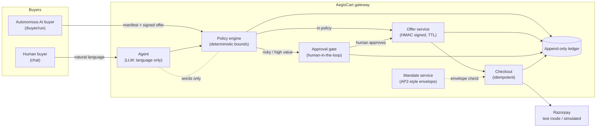
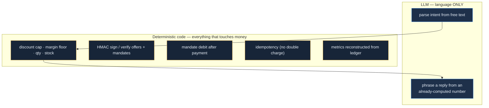
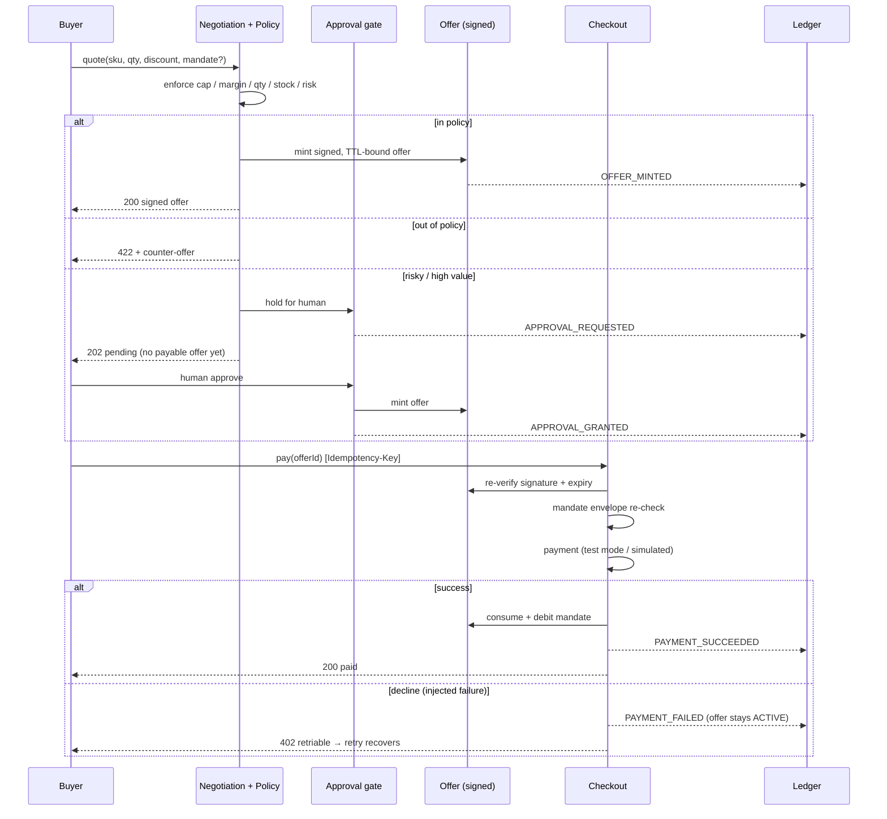
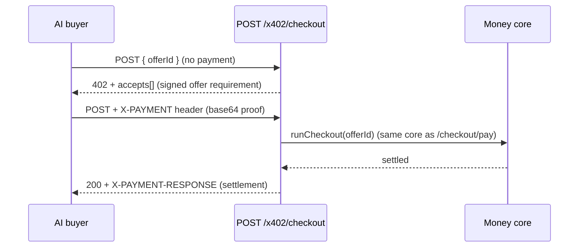

# AegisCart — Architecture

## System context

## The deterministic / LLM boundary (the "AI judgment" story)

The LLM can be creative with words; it can never invent a price. Remove the LLM entirely and the money core still runs (deterministic template fallback).

## Negotiate → gate → offer → pay → ledger

## x402 handshake

